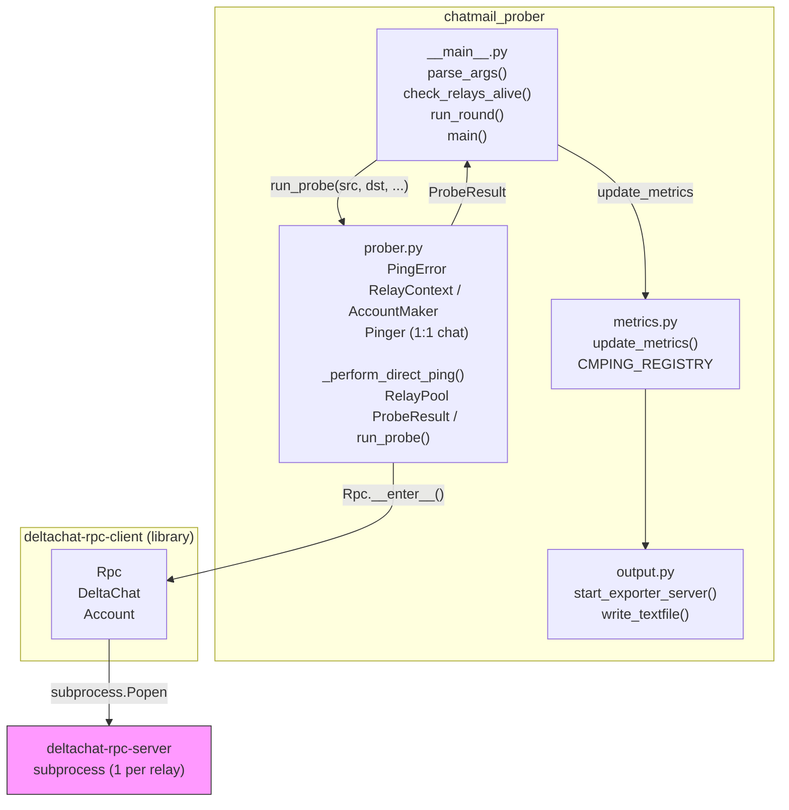
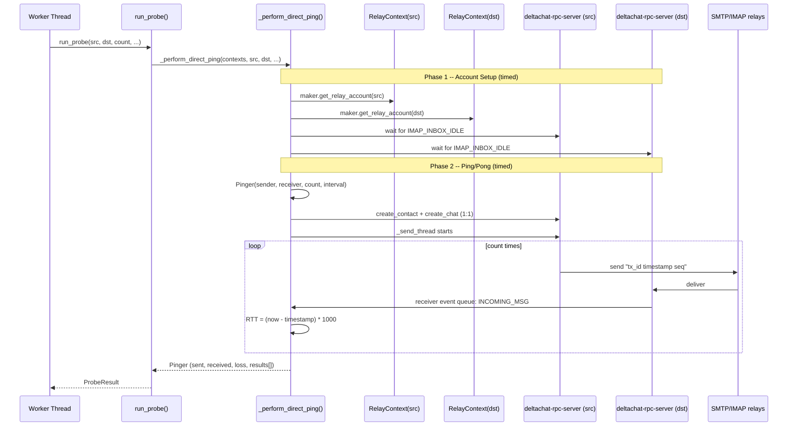
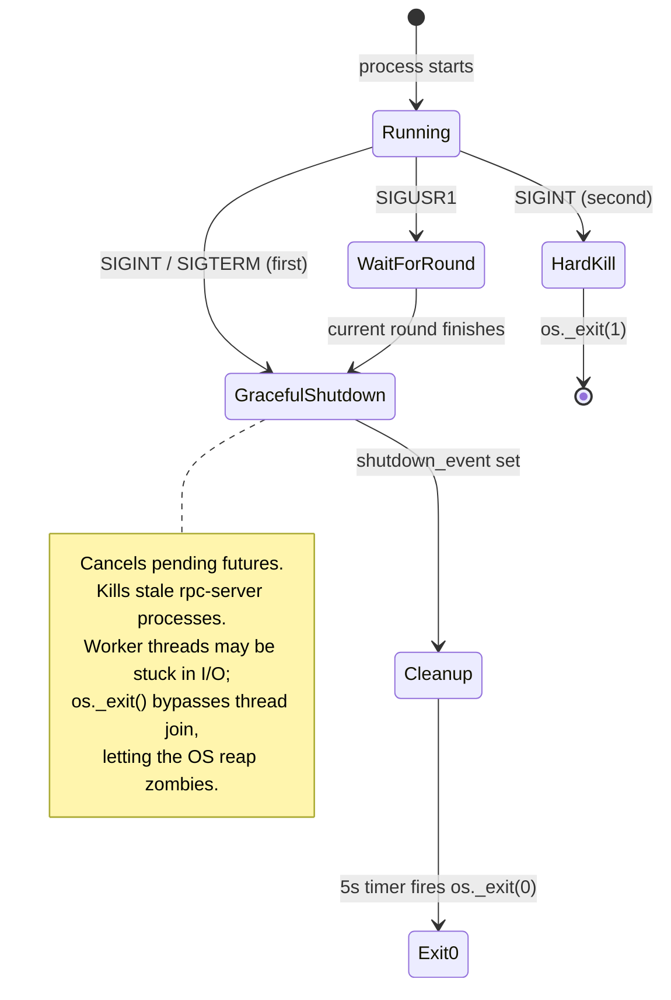

# chatmail-prober: Technical Reference

Smokeping-style Prometheus exporter for chatmail relay interoperability.
Probes all pairs of configured chatmail relays via Delta Chat message
round-trips and exports RTT histograms, loss ratios, and timing metrics.

**Viewing this with rendered diagrams**: Either through GitHub or, for example, https://www.mermditor.dev/editor

---

## Table of Contents

1. [System Overview](#1-system-overview)
2. [Repository Layout](#2-repository-layout)
3. [Component Architecture](#3-component-architecture)
4. [Probe Lifecycle](#4-probe-lifecycle)
5. [Thread Model](#5-thread-model)
6. [RelayPool and Worker Isolation](#6-relaypool-and-worker-isolation)
7. [Metrics Pipeline](#7-metrics-pipeline)
8. [Shutdown Sequence](#8-shutdown-sequence)
9. [Vendored Ping Internals](#9-vendored-ping-internals)
10. [Grafana Dashboards](#10-grafana-dashboards)
11. [Configuration Reference](#11-configuration-reference)
12. [Development Guide](#12-development-guide)
13. [Known Failure Modes](#13-known-failure-modes)
14. [Deployment](#14-deployment)

---

## 1. System Overview

The prober generates **N^2 pairs** (including self-loops A->A for baseline)
from N relays, distributes them across W worker threads, and repeats every
`--interval` seconds.

---

## 2. Repository Layout

```
chatmail-prober/
├── chatmail_prober/         # Main package
│   ├── __main__.py          # CLI, orchestration, signal handling
│   ├── prober.py            # Vendored ping logic, RelayPool, run_probe()
│   ├── metrics.py           # Prometheus metric objects + update_metrics()
│   └── output.py            # HTTP server + atomic textfile writer
├── cmping-src/              # Git submodule: standalone cmping CLI (not a runtime dep)
│   └── cmping.py            # Standalone CLI tool (own project)
├── tests/
│   ├── test_main.py         # Orchestration unit tests (mocked probes)
│   ├── test_metrics.py      # Metric computation unit tests
│   ├── test_prober.py       # run_probe() unit tests (mocked _perform_direct_ping)
│   ├── test_output.py       # Textfile writer unit tests
│   ├── test_thread_leak.py  # Thread cleanup tests (no mocking, real threads)
│   └── test_live.py         # Live integration tests (CMPING_LIVE_TEST=...)
├── grafana/
│   ├── dashboard-inter.json # Cross-relay RTT matrix
│   ├── dashboard-single.json# Single-relay smokeping view
│   └── smokeping_panel.py   # Panel JSON generator
├── pyproject.toml           # Project metadata (uv/hatchling)
├── Makefile                 # install / install-dev / test / clean
```

---

## 3. Component Architecture

The prober generates **N^2 pairs** (including self-loops A->A for baseline)
from N relays, distributes them across W worker threads, and repeats every
`--interval` seconds.



### Key design decisions

- **Vendored direct-ping logic**: The minimal subset of cmping needed for
  1:1 direct pinging is inlined in `prober.py`. This eliminates the cmping
  package dependency, its CLI output suppression, group-mode complexity,
  and verbose gating. Only structured logging remains.
- **1:1 chat, not group**: Each probe creates a direct contact + chat between
  sender and receiver. No group creation, no join wait, no multi-receiver
  thread pool. This halves the thread count per probe and eliminates the
  group-join phase entirely.
- **Per-worker RelayPools**: Each worker thread gets its own RelayPool with
  an isolated accounts directory. Within a worker, accounts are reused across
  probes via `get_relay_account()`. W workers * N relays = W*N subprocesses.

---

## 4. Probe Lifecycle

One end-to-end probe between `src` and `dst`:



### Probe message format

```
<30-char alphanum tx_id> <unix_timestamp_float> <seq_number_padded_17>
e.g.: "abcdefghijklmnopqrstuvwxyz0123 1734567890.1234            0"
```

RTT is computed by the receiver: `(time.time() - float(parts[1])) * 1000` ms.

### Timing phases stored in ProbeResult

| Field | Measures |
|---|---|
| `account_setup_time` | Rpc start + IMAP_INBOX_IDLE wait |
| `message_time` | Full send+receive loop |

---

## 5. Thread Model

### Thread lifetimes

| Thread | Created by | Lifetime | Cleanup |
|---|---|---|---|
| Worker threads | `ThreadPoolExecutor(max_workers=1)` | Entire process | `executor.shutdown()` |
| `_send_thread` | `Pinger.__init__` | Until all pings sent (or deadline) | `join(timeout=2.0)` in `_perform_direct_ping` |
| `events_thread` | `Rpc.start()` | Until `Rpc.close()` | `Rpc.close()` joins it |
| `reader_thread` | `Rpc.start()` | Until stdout closed | `Rpc.close()` joins it |
| `writer_thread` | `Rpc.start()` | Until stdin closed | `Rpc.close()` joins it |

The vendored Pinger uses a single-receiver inline loop in `receive()` --
no receiver thread pool. This eliminates the thread leak that previously
occurred when receiver threads blocked on `queue.get()` without a timeout.

---

## 6. Per-Worker Pools and Account Reuse

Each worker thread gets its own RelayPool with an isolated accounts directory.

### Account reuse

Within a worker, `get_relay_account(domain, exclude)` returns an
`(account, was_online)` tuple. When `was_online` is True the account is
already connected and `wait_account_online()` can be skipped, saving the
IMAP_INBOX_IDLE wait. The `exclude` parameter prevents the same account
from being used as both sender and receiver in a self-probe.

### Account directory layout

```
~/.cache/chatmail-prober/
├── worker-0/
│   ├── relay-a.example/
│   │   ├── accounts.toml
│   │   └── ...
│   ├── relay-b.example/
│   └── relay-c.example/
├── worker-1/
│   ├── relay-a.example/
│   ├── relay-b.example/
│   └── relay-c.example/
└── alive-check/             # used only during pre-flight alive check
    ├── relay-a.example/
    └── ...
```

Each worker's RelayPool manages its own set of `deltachat-rpc-server`
subprocesses and accounts directories (open, close, reopen on RPC crash).

---

## 7. Metrics Pipeline

### Labels

Per-pair metrics carry three labels:

| Label | Values |
|---|---|
| `source` | source relay domain |
| `destination` | destination relay domain |
| `probe_type` | `"self"` if src==dst, `"cross"` otherwise |

Round-level metrics (`cmping_last_round_completion_timestamp`,
`cmping_round_duration_seconds`) have no labels.

`cmping_relay_status` has a single `relay` label. It is set per configured
relay in `check_relays_alive()`, not in `update_metrics()`. The integer
value encodes both state and error category: 1=online, 0=unknown error,
-1=timeout, -2=setup failure, -3=auth, -4=tls/cert, -5=connection refused,
-6=dns. This stable series identity avoids the label-churn problem that
occurred with the previous `cmping_relay_available` metric (which used a
`reason` label whose value changed between rounds).

DNS errors reported by the Delta Chat RPC are cross-checked via
`verify_relay_status()`: when the RPC reports a DNS failure, the base domain
and autoconfig subdomains (`imap.*`, `smtp.*`) are resolved with
`socket.getaddrinfo()`. If the base domain resolves, the error is
reclassified as -1 (timeout) rather than -6 (dns), since the actual cause
is a filtered port or broken autoconfig, not a DNS problem.

### Error behavior

On probe error, RTT gauges (median, p10, p90, stddev) and
`account_setup_seconds` are set to NaN so Grafana panels show a gap
instead of stale values from the previous successful round.

### Stale label cleanup

At the start of each round, `clear_stale_labels()` removes metric label
sets for relays no longer in the active set.  This prevents label
cardinality from growing unbounded when relays are removed.

### Registry split

Two registries exist to avoid double-counting process metrics:

- `CMPING_REGISTRY`: only probe metrics -- used for textfile output (no
  `process_*` or `python_*` collectors that node_exporter would also expose)
- default `REGISTRY`: everything -- used by the HTTP endpoint

---

## 8. Shutdown Sequence



The 5-second timer in the signal handler fires `os._exit(0)` as a backstop if
the main thread stays stuck in `as_completed()` after all futures are cancelled.

SIGUSR2 cycles through verbosity levels at runtime without restarting:
quiet (WARNING only) -> normal (INFO) -> debug (DEBUG) -> debug+rpc (DEBUG for all loggers).

---

## 9. Vendored Ping Internals

The direct-ping logic in `prober.py` is vendored from cmping and simplified
for the prober's single-receiver, 1:1 chat use case.

---

## 10. Grafana Dashboards

| File | Purpose | Key panels |
|---|---|---|
| `dashboard-inter.json` | Cross-relay RTT matrix | Heatmap, pair table, per-pair smokeping |
| `dashboard-single.json` | Single relay deep-dive | Smokeping plot, peer RTT breakdown |

All dashboards use a `$datasource` template variable to select the Prometheus
instance.  RTT panels use three queries (p10, median, p90) to draw the
Smokeping-style gray band + colored median line.

### Smokeping panel query pattern

```promql
# Median (solid line, color = threshold)
cmping_rtt_median_seconds{probe_type="cross", source="$relay"}

# p90 (upper band edge, hidden)
cmping_rtt_p90_seconds{...}

# p10 (lower band edge, hidden)
cmping_rtt_p10_seconds{...}
```

Thresholds: dark-green <2s, green <6s, light-green <24s, yellow <48s, red <60s, dark-red >=60s.

---

## 11. Configuration Reference

```
chatmail-prober [relays_file ...] [options]
```

| Flag | Default | Description |
|---|---|---|
| `relays` | (optional) | One or more relay list files; merged and deduplicated |
| `-H, --hosts LIST` | `None` | Comma-separated relay list overriding relay file(s) |
| `--auto-fetch PATH` | `None` | Fetch relay list from upstream URL, write to PATH, add to sources |
| `--port` | `0` | HTTP /metrics listen port (0 = disabled) |
| `--textfile` | `None` | Path for node_exporter textfile .prom output |
| `-i, --interval` | `900` | Seconds between probe rounds |
| `-n, --count` | `5` | Pings per pair per round |
| `--ping-interval` | `0.1` | Seconds between individual pings within a probe |
| `-t, --timeout` | `90` | Per-pair receive timeout in seconds |
| `-w, --workers` | `5` | Concurrent worker threads |
| `--cache-dir` | `~/.cache/chatmail-prober` | Root for per-worker account dirs |
| `--reset [DOMAIN...]` | `None` | Reset cached accounts; "all" resets all, DOMAIN args reset only those |
| `--exclude PATH` | `None` | File of pairs to skip: `src->dst` per line |
| `-1, --once` | false | Run one round then exit (useful with --textfile in cron) |
| `-p, --print` | false | Print tabular summary to stdout after --once exits |
| `-m, --print-metrics` | false | Print Prometheus metrics to stdout after --once exits |
| `--scan` | false | Self-probe all relays in parallel, print ranked by RTT, exit |
| `--top N` | `10` | Relays to highlight in --scan output |
| `-v` | 0 | Debug logging (-vv debug+rpc/deltachat events) |
| `-q, --quiet` | false | Quiet: suppress progress, show only warnings/errors |

At least one of `relays`, `--hosts`, or `--auto-fetch` must be provided. When multiple are
given, domains from all sources are merged and deduplicated. The default
fetch URL is `https://chatmail.at/relays` (parses `<a class="hilite">` entries).

### Relay list format

```
# Lines starting with # are ignored
# Blank lines are ignored
nine.testrun.org
mehl.cloud
tarpit.fun
```

### Exclude list format

```
# Skip known-broken pairs (one per line)
broken-relay.example -> mehl.cloud
tarpit.fun -> broken-relay.example
```

---

## 12. Development Guide

### Setup

```bash
uv sync --dev      # creates .venv, installs deps + pytest
# or:
make install-dev
```

### Running tests

```bash
uv run pytest tests/                                    # all tests (live tests use relays.txt.example)
uv run pytest tests/ --ignore=tests/test_live.py -v     # unit tests only, no network
make test                                                # same via Makefile

# Live integration tests (defaults to relays.txt.example):
uv run pytest tests/test_live.py -v
CMPING_LIVE_TEST=custom.relay uv run pytest tests/test_live.py -v  # override relays
```

### Test categories

| File | Requires network | Mocks |
|---|---|---|
| `test_main.py` | No | `run_probe` monkeypatched |
| `test_metrics.py` | No | Fresh prometheus registry |
| `test_prober.py` | No | `_perform_direct_ping` monkeypatched |
| `test_output.py` | No | None |
| `test_thread_leak.py` | No | None -- real threads + queues |
| `test_live.py` | Yes (defaults to relays.txt.example; override with CMPING_LIVE_TEST) | None -- full stack |

### Adding a metric

1. Add a `Gauge`/`Counter` to `metrics.py` using `CMPING_REGISTRY`
2. Set it in `update_metrics()` in `metrics.py`
3. Add the label set to the fixture in `tests/test_metrics.py`

### Debugging high thread counts

```bash
# Count live threads in the running process
cat /proc/<pid>/status | grep Threads   # should stay near constant across rounds

# Safe graceful stop (waits for current round to finish)
kill -USR1 <pid>

# Verbose probe output for one round
chatmail-prober relays.txt --once -v 2>&1 | head -200
```

---

## 13. Known Failure Modes

### Probe round exceeds interval

**Symptom**: Log line `"Probe round took Xs, exceeds interval Ys -- starting next immediately"`.

**Cause**: N^2 pairs with high --timeout, slow relays, or too few workers.

**Tuning**: Reduce `--timeout`, increase `--workers`, or reduce N (fewer relays).
The round time is roughly `ceil(N^2 / workers) * avg_probe_time`.

### Dead relay contaminates metrics

**Symptom**: A relay is down but metrics still show last round's values.

**Handling**: The pre-flight `check_relays_alive()` classifies errors and
applies retry logic:

- Persistent errors (auth, TLS, connection refused, genuine DNS) -> exclude immediately
- Transient errors (timeout, unknown, reclassified DNS) on new failures -> retry up to 2 times
- Transient errors on previously-dead relays -> skip retry (initial probe detects recovery)
- All relays get a fresh probe each round so recovery is detected within one cycle

The transient/persistent classification uses `is_transient_alive_error()`
which calls `verify_relay_status()` to distinguish false DNS errors
(reclassified as timeout, retryable) from genuine ones.  Previously-dead
relays still get the initial probe each round (so recovery is detected
within one cycle) but skip the retry phase since retrying within the same
window won't help a persistent outage.

Dead relays after all retries are excluded from the matrix.
They are exposed via `cmping_relay_status{relay="..."} < 1` (negative
values encode the error category) and also appear in
`cmping_send_errors_total` and `cmping_probe_success=0`.

### MemoryError / "can't start new thread"

**Symptom**: `MemoryError` in `threading._after_fork`, followed by
`can't start new thread` errors mid-round.

**Root cause**: Thread accumulation. The vendored Pinger uses an inline
receive loop (no thread pool), eliminating the primary historical cause
of thread leaks. GC runs every 50 pairs as a secondary safeguard.

**Diagnosis**:
```bash
cat /proc/<pid>/status | grep Threads   # should stay near constant
```

**Mitigation**: Restart the process if thread count grows unexpectedly.

### deltachat-rpc-server orphans after crash

**Symptom**: `accounts.lock` still held, next startup fails to acquire lock.

**Handling**: On startup, `__main__.py` runs:
```python
_kill_stale_rpc_servers(cache_dir)   # pgrep -f deltachat-rpc-server.*cache_dir
for lock in cache_dir.rglob("accounts.lock"):
    lock.unlink(missing_ok=True)
```

### RPC crash mid-round

**Symptom**: Probes fail with BrokenPipe/ConnectionReset/EOFError errors.

**Handling**: When `run_round()` detects an RPC-level error keyword in a
probe's error string, it calls `pool.reopen(relay)` to close the dead
context and start a fresh one. Subsequent probes for that relay use the
new context.

### File descriptor exhaustion

**Symptom**: `OSError: [Errno 24] Too many open files` from deltachat or IMAP.

**Handling**: On startup, fd soft limit is raised to the hard limit:
```python
resource.setrlimit(resource.RLIMIT_NOFILE, (hard, hard))
```

Systemd units may also need `LimitNOFILE=65536` in the `[Service]` section.

---

## 14. Deployment

Three unit files live in `systemd/`:

| File | Type | Purpose |
|---|---|---|
| `chatmail-prober.service` | service | Long-running prober daemon |
| `chatmail-prober-prom-copy.path` | path | Watches the `.prom` textfile for writes |
| `chatmail-prober-prom-copy.service` | service (oneshot) | Copies `.prom` into node-exporter's directory |

### System user

The prober runs as a dedicated unprivileged system account whose home
directory doubles as the uv install root:

```bash
sudo useradd -r -s /usr/sbin/nologin -d /opt/chatmail-prober chatmail-prober
```

### Paths

| Path | Purpose |
|---|---|
| `/opt/chatmail-prober/` | Home dir for the service user; uv installs to `.local/bin/uv` here |
| `/opt/chatmail-prober/chatmail-prober/` | Git repo (`WorkingDirectory`) |
| `/var/lib/chatmail-prober/relays.txt` | Relay list cache written by `--auto-fetch` on each startup |
| `/var/lib/chatmail-prober/` | Per-relay account cache and state (created by `StateDirectory=`) |
| `/var/tmp/chatmail-prober.prom` | Textfile written atomically by the prober |
| `/var/lib/prometheus/node-exporter/chatmail-prober.prom` | Destination for node-exporter |

### Bootstrap

```bash
# Create home dir and system user (home doubles as uv install root)
sudo mkdir /opt/chatmail-prober
sudo useradd -r -s /usr/sbin/nologin -d /opt/chatmail-prober chatmail-prober
sudo chown chatmail-prober:chatmail-prober /opt/chatmail-prober

# Clone the repo and install dependencies as the service user
sudo -u chatmail-prober git clone \
    https://github.com/chatmail/chatmail-prober \
    /opt/chatmail-prober/chatmail-prober
sudo -u chatmail-prober sh -c 'curl -LsSf https://astral.sh/uv/install.sh | sh'
sudo -u chatmail-prober sh -c 'cd /opt/chatmail-prober/chatmail-prober && make install'
```

### Installing systemd units

```bash
sudo cp /opt/chatmail-prober/chatmail-prober/systemd/chatmail-prober.service \
       /opt/chatmail-prober/chatmail-prober/systemd/chatmail-prober-prom-copy.path \
       /opt/chatmail-prober/chatmail-prober/systemd/chatmail-prober-prom-copy.service \
       /etc/systemd/system/
sudo systemctl daemon-reload
sudo systemctl enable --now chatmail-prober.service
sudo systemctl enable --now chatmail-prober-prom-copy.path
```

`StateDirectory=chatmail-prober` causes systemd to create and own
`/var/lib/chatmail-prober` on first start; no manual `mkdir` is needed.

The path unit fires `chatmail-prober-prom-copy.service` immediately each
time `/var/tmp/chatmail-prober.prom` is modified (including the atomic
rename the prober uses), so node-exporter always sees a fresh file within
seconds of a completed round.

### Graceful restart

`ExecReload=kill -s USR1 $MAINPID` wires SIGUSR1 into the standard reload
interface.  SIGUSR1 tells the running prober to exit cleanly after the
current probe round finishes; `Restart=always` then starts a fresh process.

```bash
# Wait for the current round to finish, then restart:
sudo systemctl reload chatmail-prober

# Check status / recent log output:
systemctl status chatmail-prober
journalctl -u chatmail-prober -f
```

`check_relays_alive()` runs at the start of every round, so previously-dead
relays are rechecked automatically without manual intervention.
